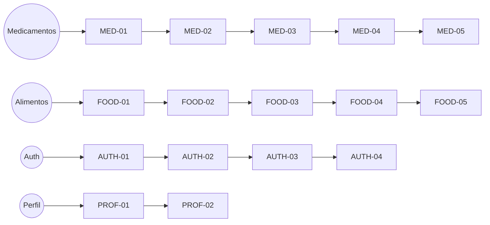
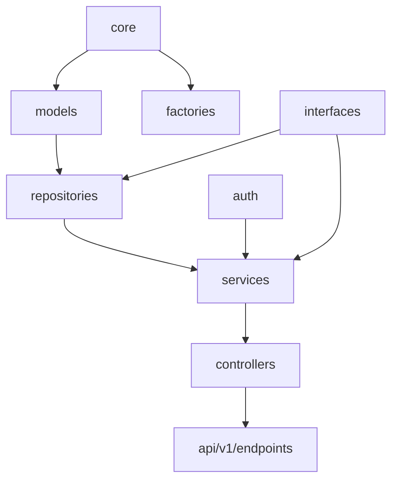
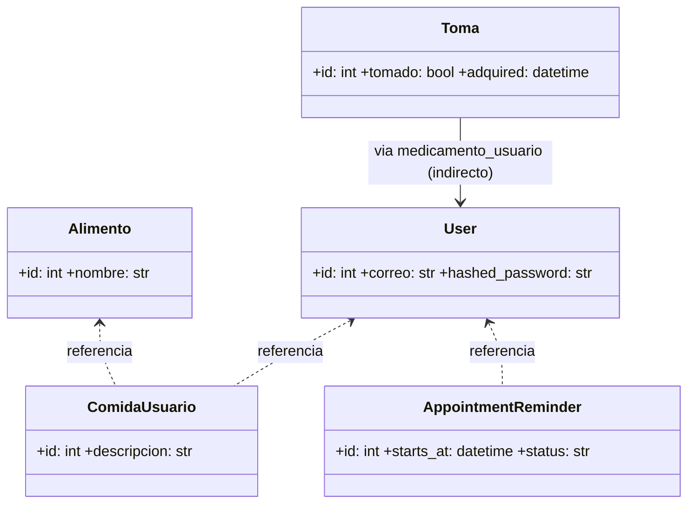
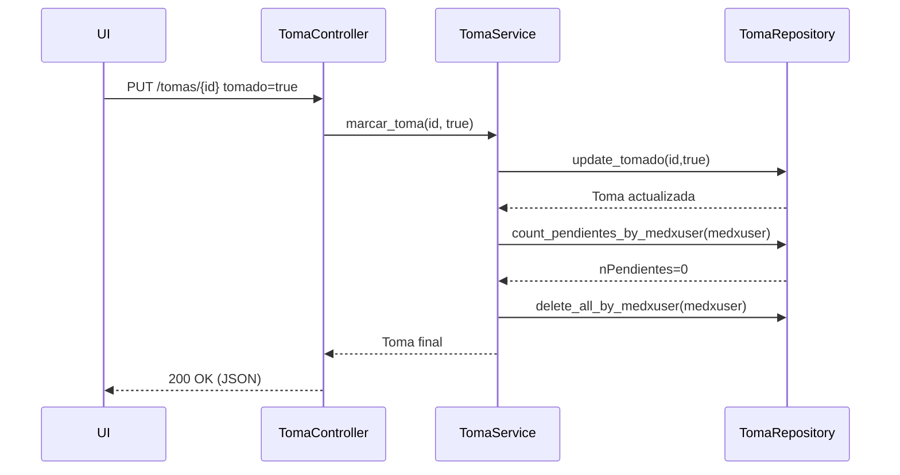
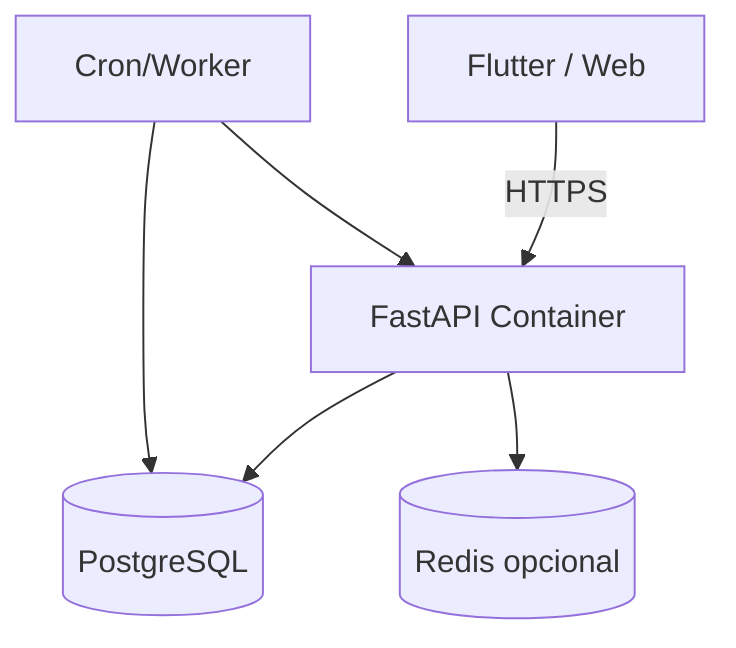

# 9. Vista Funcional

## 9.2 Historias de Usuario

Las historias se agrupan por épicas (dominios funcionales). Cada historia incluye objetivo y valor. Se incluyen diagramas Mermaid para visualización textual.

### Épica: Gestión de Medicamentos y Tomas
| ID | Historia | Objetivo | Valor |
|----|----------|----------|-------|
| MED-01 | Como usuario registro un medicamento con su dosis y frecuencia | Guardar esquema posológico | Evitar olvidar dosis |
| MED-02 | Como usuario quiero ver próximas tomas programadas | Visualizar agenda farmacológica | Planificación diaria |
| MED-03 | Como usuario marco una toma como realizada | Actualizar estado de dosis | Seguimiento terapéutico |
| MED-04 | Como usuario pospongo una toma a más tarde | Ajustar horario por imprevistos | Flexibilidad |
| MED-05 | Como usuario recibo notificación cuando una toma está próxima | Recordatorio oportuno | Adherencia |

### Épica: Catálogo y Registro de Alimentos
| ID | Historia | Objetivo | Valor |
|----|----------|----------|-------|
| FOOD-01 | Como usuario consulto catálogo global de alimentos | Explorar base | Selección rápida |
| FOOD-02 | Como usuario busco alimentos por nombre | Filtrar rápidamente | Usabilidad |
| FOOD-03 | Como usuario veo detalle de un alimento | Obtener atributos/identidad | Decisión informada |
| FOOD-04 | Como usuario asocio alimento a mi perfil con descripción | Personalizar registro | Seguimiento nutricional |
| FOOD-05 | Como usuario elimino una asociación errónea | Limpiar datos | Calidad |

### Épica: Autenticación y Sesión
| ID | Historia | Objetivo | Valor |
|----|----------|----------|-------|
| AUTH-01 | Como usuario inicio sesión con correo y contraseña | Obtener acceso | Seguridad |
| AUTH-02 | Como usuario renuevo mi token cuando expira | Mantener sesión activa | Continuidad |
| AUTH-03 | Como usuario cierro sesión | Invalidar contexto cliente | Control |
| AUTH-04 | Como usuario recupero mi contraseña | Reestablecer acceso | Disponibilidad |

### Épica: Perfil y Seguridad
| ID | Historia | Objetivo | Valor |
|----|----------|----------|-------|
| PROF-01 | Como usuario cambio mi contraseña cumpliendo política mínima | Asegurar credenciales | Seguridad |
| PROF-02 | Como usuario elimino definitivamente mi cuenta | Ejercer control sobre datos | Privacidad |

### Diagrama de Casos de Uso (Mermaid)

```mermaid
graph TD
  U[(Usuario)] --> MED1[Registrar medicamento]
  U --> MED2[Ver próximas tomas]
  U --> MED3[Marcar toma]
  U --> MED4[Posponer toma]
  U --> MED5[Recibir notificación]
  U --> FOOD1[Listar alimentos]
  U --> FOOD2[Buscar alimento]
  U --> FOOD3[Ver detalle alimento]
  U --> FOOD4[Registrar alimento personal]
  U --> FOOD5[Eliminar registro alimento]
  U --> AUTH1[Iniciar sesión]
  U --> AUTH2[Refrescar token]
  U --> AUTH3[Cerrar sesión]
  U --> AUTH4[Recuperar contraseña]
  U --> PROF1[Cambiar contraseña]
  U --> PROF2[Eliminar cuenta]
```


## 9.3 Mapa de Historias (Story Map)



Jerarquía:
- Épicas → Funcionalidades → Historias → (Tareas técnicas: endpoints, validaciones, tests, repositorios)

Prioridad Inicial (Razonamiento):
1. Autenticación básica (AUTH-01) para habilitar acceso seguro.
2. Registro de medicamentos y tomas (MED-01, MED-02) por ser núcleo de valor clínico.
3. Catálogo de alimentos (FOOD-01, FOOD-02) como soporte nutricional secundario.
4. Acciones de mantenimiento: perfil y seguridad (PROF-01, PROF-02).
5. Extensiones UX: notificaciones (MED-05), posponer tomas (MED-04).

## 9.2 Razonamiento Arquitectónico Funcional

Se priorizaron historias que habilitan el caso de uso principal (adherencia a medicamentos) antes de elementos complementarios (alimentos). Las historias se agrupan por dominios para facilitar desacoplamiento y permitir equipos paralelos: Medicamentos, Alimentos, Auth, Perfil. Cada dominio mantiene su propio conjunto de repositorios y servicios, garantizando cohesión. Se adoptó un patrón Service + Repository para aislar reglas de negocio de persistencia. Las notificaciones se diseñan como extensión no intrusiva (OCP) aprovechando `TomaRepository.get_pending_at`. El cierre de sesión se mantiene stateless (JWT) para simplicidad inicial y bajo acoplamiento.

# 10. Vista Lógica

## 10.1 Estructura General del Sistema (Paquetes)


## 10.2 Componentes o Módulos Principales
- `app/models`: Entidades ORM (Usuario, Alimento, ComidaUsuario, Toma, Medicamento, AppointmentReminder).
- `app/repositories`: Acceso a datos (SQLAlchemy) por entidad; encapsulan queries y commits.
- `app/services`: Reglas de negocio (validaciones, integridad, operaciones compuestas).
- `app/controllers`: Adaptan servicios a HTTP, mapean excepciones a códigos.
- `app/interfaces`: Abstracciones (ISP + DIP) para garantizar sustituibilidad y testabilidad.
- `app/factories/ServiceFactory`: Abstract Factory centraliza creación e inyección de dependencias.
- `app/auth`: Estrategias de hashing y generación de tokens (Strategy Pattern).
- `app/core`: Configuración y sesión DB.

## 10.3 Diagrama de Clases (Simplificado)


## 10.3 Diagrama de Secuencia (Marcar Toma)


## 10.3 Patrones de Diseño Utilizados
- Repository Pattern: Encapsula acceso a datos y reduce duplicación de queries.
- Service Layer: Agrega reglas de negocio y secuencia de operaciones complejas.
- Abstract Factory (`ServiceFactory`): Centraliza creación; facilita sustitución por mocks en testing.
- Strategy (Tokens / Hashing): Permite intercambiar implementación de credenciales.
- Dependency Injection: Controladores no acoplan a concreciones; se inyectan servicios.
- SOLID: SRP, OCP, LSP, ISP, DIP aplicados sistemáticamente.

## 10.3 Razonamiento Arquitectónico Lógico
La separación en capas y uso de interfaces se eligió para permitir escalado por dominios (añadir Ejercicios o Reportes sin afectar Medicamentos). Se descartó un enfoque monolítico sin capas por su impacto en mantenibilidad. Los diagramas muestran dependencias dirigidas (sin ciclos) favoreciendo test unitarios aislados. La elección de Strategy en tokens permitió entorno de pruebas con generador mock sin impacto en producción. Se evitó un microservicio temprano para reducir complejidad operativa inicial.

# 11. Vista de Implementación

## 11.1 Estructura del Código Fuente
```
BackendMimedicApp/
  app/
    core/          # Config, DB
    models/        # ORM SQLAlchemy
    interfaces/    # Abstracciones (repos/services)
    repositories/  # Implementaciones de acceso a datos
    services/      # Lógica de negocio
    controllers/   # Adaptación HTTP
    factories/     # ServiceFactory
    auth/          # JWT, hashing
    api/v1/        # Endpoints FastAPI
  tests/           # Pruebas unitarias (pytest/unittest)
  docs/            # Documentación
  requirements.txt # Dependencias Python
```

Convenciones: nombres en minúscula con guión bajo, entidades en singular, repositorios sufijo `_repo`, servicios sufijo `_service`. Separación clara dominios facilita refactor.

## 11.2 Frameworks, Bibliotecas y Dependencias
- FastAPI: Framework web asíncrono, rendimiento y tipado claro (endpoints).
- Uvicorn: ASGI server para ejecutar FastAPI.
- SQLAlchemy 2.x: ORM y Core para acceso DB relacional.
- python-jose[cryptography]: Firmado/decodificación JWT segura.
- Pydantic / pydantic-settings: Validación y settings tipados.
- python-decouple: Lectura de variables de entorno.
- psycopg2: Driver PostgreSQL (producción) con fallback SQLite dev.
- bcrypt: Hashing de contraseñas.
- reportlab: Generación potencial de PDFs (reportes clínicos/exportaciones).
- python-multipart: Manejo de uploads si requerido.
- pytest / unittest: Testing automatizado.

## 11.3 Diagrama de Componentes de Implementación
```mermaid
graph TD
  FastAPI[FastAPI App] --> Controllers
  Controllers --> Services
  Services --> Repositories
  Repositories --> DB[(PostgreSQL / SQLite)]
  Auth[Auth Module] --> Services
  ServiceFactory --> Services
  ServiceFactory --> Repositories
  Settings[Config (.env)] --> FastAPI
```

## 11.4 Razonamiento Arquitectónico de Implementación
La organización en capas permite aislar pruebas (mock de repositorios). El uso de `ServiceFactory` reduce código repetitivo de wiring y facilita sustitución futura por contenedor DI más complejo. La estructura es modular, permitiendo extraer dominios a microservicios si la escala lo exige. El uso de Pydantic reduce errores de tipo y facilita documentación automática (OpenAPI). Se descartó usar un framework monolítico como Django por necesidad de mayor flexibilidad en servicios desacoplados.

# 12. Vista de Despliegue

## 12.1 Arquitectura de Despliegue
Entornos previstos:
- Local: FastAPI + SQLite (modo desarrollo rápido).
- Staging: FastAPI container (Docker) + PostgreSQL gestionado + servicio de correo/notificaciones simulado.
- Producción: Contenedor (Uvicorn/Gunicorn) detrás de reverse proxy (Nginx), PostgreSQL administrado, potencial broker (RabbitMQ o Redis) para notificaciones futuras.

Componentes:
- Servidor API (FastAPI) expone `/api/v1`.
- Base de datos relacional para integridad y relaciones (adherencia, catálogo).
- Almacenamiento de configuración a través de variables de entorno (.env en dev).
- (Opcional futuro) Worker de tareas programadas (cron) para escaneo `get_pending_at`.

## 12.2 Topología del Sistema


## 12.3 Razonamiento Arquitectónico de Despliegue
Se eligió arquitectura containerizada por portabilidad. PostgreSQL asegura consistencia transaccional para entidades críticas (tomas, recordatorios). Un scheduler externo permite escalar carga de notificaciones sin bloquear el thread principal. Redis se contempla sólo para optimizaciones de caché (no obligatorio en fase inicial). El enfoque stateless facilita escalamiento horizontal del API detrás de balanceador. Seguridad basada en JWT simplifica replicación frente a sesiones centralizadas.

# 12. Referencia Bibliográfica
- Gamma et al. (1994). Design Patterns: Elements of Reusable Object-Oriented Software.
- Robert C. Martin. Clean Architecture / SOLID Principles.
- SQLAlchemy 2.0 Documentation.
- FastAPI Official Documentation.
- Pydantic Documentation.
- OWASP Cheat Sheets (Autenticación y JWT).

---
Este documento resume la arquitectura funcional, lógica, de implementación y despliegue, evidenciando principios SOLID y patrones aplicados para mantener escalabilidad y mantenibilidad.
